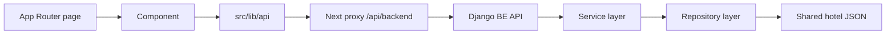

# FE Design

## Overview
The FE is a Next.js 15 App Router application built with React 19 and TypeScript. It uses a template-driven UI, but the integration layer now follows a cleaner separation of concerns:

- UI components render the view.
- API wrappers in `src/lib/api` handle backend communication.
- Shared domain contracts live in `src/types`.
- Route-level pages under `src/app` compose the final screens.

The goal is to keep the FE easy to extend without mixing data access, state, and presentation in the same place.

## Top-Level Structure

```text
FE/
├─ package.json
├─ next.config.ts
├─ tsconfig.json
├─ eslint.config.mjs
├─ public/
│  ├─ assets/
│  ├─ data/
│  │  └─ hotels_vietnam.json
│  └─ robots.txt
├─ src/
│  ├─ app/
│  ├─ components/
│  ├─ data/
│  ├─ helper/
│  ├─ layout/
│  ├─ lib/
│  │  └─ api/
│  └─ types/
└─ .env.local.example
```

## Folder Roles

### `src/app`
Route segments for the App Router.

- `page.tsx` is the home page.
- `room/page.tsx`, `destination/page.tsx`, `contact/page.tsx`, etc. compose page-level layouts.
- `layout.tsx` provides the global shell.
- `globals.css` contains global styles.
- `sitemap.ts`, `not-found.tsx`, `global-error.tsx`, and `error.tsx` handle framework-level behavior.

### `src/components`
Reusable UI blocks and feature sections.

Current integration-related components:

- `Checkout.tsx` loads province data from the backend through a client API wrapper.
- `PropertiesInner.tsx` loads featured hotels from the backend and renders the main hotel slider.
- `BannerThree.tsx` and other banner/section components keep the visual template structure.

This directory is still largely template-driven, but the data-facing components now depend on the API layer instead of calling external endpoints directly.

### `src/lib/api`
Frontend API client layer.

- `backend.ts` centralizes the base request logic.
- `hotelApi.ts` exposes hotel-related read operations.
- `locationApi.ts` exposes province/location read operations.

This is the main place to add new FE-to-BE communication so the components stay focused on rendering.

### `src/types`
Shared TypeScript contracts for FE data.

- `hotel.ts` defines hotel models and API response shapes.
- `location.ts` defines province/location response shapes.

These types keep the API layer and components aligned.

### `src/helper`
App bootstrapping and client-only utilities such as animation setup, scrolling helpers, and other effect-driven wrappers.

### `src/data`
Static UI data used by template sections and navigation.

### `public/data`
Static JSON assets. The current hotel dataset is stored in `public/data/hotels_vietnam.json` and is used by the backend service layer as the shared source of truth.

## Data Flow



### Current FE Connections

- `PropertiesInner.tsx` calls `fetchFeaturedHotels()`.
- `Checkout.tsx` calls `fetchProvinces()`.
- Requests go through `src/lib/api/backend.ts`.
- `next.config.ts` rewrites `/api/backend/*` to the Django backend during local development.

## Route Composition Pattern

Most page files follow the same shape:

1. Import the shared layout pieces.
2. Import the section components.
3. Compose the page from top to bottom.

Example pages using the checkout section include:

- `src/app/page.tsx`
- `src/app/room/page.tsx`
- `src/app/destination/page.tsx`
- `src/app/contact/page.tsx`
- `src/app/gallery/page.tsx`
- `src/app/appointment/page.tsx`
- `src/app/about/page.tsx`
- `src/app/animations/page.tsx`
- `src/app/destination-details/page.tsx`

## Integration Notes

- The FE should not call the backend directly from UI components.
- Any new backend read/write action should get a wrapper in `src/lib/api` first.
- Any new response shape should get a type in `src/types`.
- Keep presentational components free of transport logic where possible.
- Use the Next proxy route for local development so the browser code stays same-origin.

## Environment

`FE/.env.local.example` documents the local configuration:

- `NEXT_PUBLIC_BACKEND_API_BASE_URL=/api/backend`
- `BACKEND_ORIGIN=http://127.0.0.1:8000`

## Build and Validation

The FE currently builds successfully with `npm run build` from the `FE` directory.

Linting still contains legacy template debt in unrelated components, so production builds are configured to skip lint during build in `next.config.ts`.

## Extension Points

Suggested places to extend the FE cleanly:

- Add new API clients in `src/lib/api`.
- Add shared contracts in `src/types`.
- Add backend-driven sections in `src/components`.
- Add route-level composition in `src/app`.

## Summary

The FE is organized around three layers:

- Presentation in `src/components`.
- Transport in `src/lib/api`.
- Route composition in `src/app`.

That keeps the current booking flow easier to maintain and matches the SOLID direction used in the backend integration.
